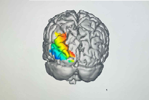
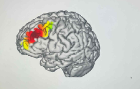
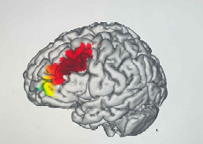

# tES Protocol Simulation (tDCS, tACS, tRNS)

This project explores transcranial electrical stimulation (tES) protocols targeting specific cortical regions using computational head models.  
The work was conducted as part of a research internship focusing on brain stimulation and modeling.

---

## 🎯 Objective
To implement and evaluate stimulation protocols under different conditions and examine how electric field distributions vary across stimulation types.

---

## 🧠 Protocol Conditions

The following stimulation protocols were implemented:

- **tDCS** targeting the middle occipital region (left hemisphere)  
- **40 Hz tACS** targeting the middle frontal region (left hemisphere)  
- **Combined stimulation** (1 mA tDCS + 1 mA tRNS) targeting the middle frontal region  

Due to data availability, simulations were conducted using a female head model.

---

## ⚙️ Implementation

Stimulation protocols were configured based on predefined task requirements.  
Electrode placement and current parameters were adjusted to achieve focal stimulation in the target regions.

The protocol configurations are stored as `.neprot` files.

---

## 📂 Files

- `protocols/tdcs_occipital.neprot`  
- `protocols/tacs_frontal.neprot`  
- `protocols/tdcs_trns_combined.neprot`  

These files contain electrode configurations and stimulation parameters used in the simulations.

---

## 📊 Results

### tDCS (Occipital region)

---

### tACS (Frontal region, 40 Hz)

---

### tDCS + tRNS (Frontal region)

---

## 🔍 Observations

- Electric field distribution varied depending on stimulation type  
- tACS showed oscillatory stimulation characteristics  
- Combined stimulation produced broader field coverage  
- Target regions were successfully engaged across conditions  

---

## 📝 Notes
- This work was conducted as part of a course assignment and research internship  
- Protocol design was based on predefined experimental requirements  
- Focus on simulation and evaluation rather than full optimization  
